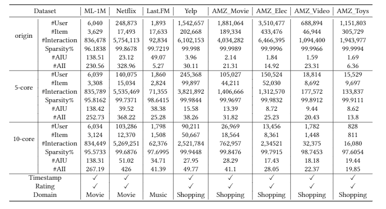

# RecSysEvaluation
This is our code and supplementary materials for the paper:

> Wayne Xin Zhao, Zihan Lin, Zhichao Feng, PengFei Wang and Ji-Rong Wen (2021). A Revisiting Study of Appropriate Offline Evaluation for Top-𝑁Recommendation Algorithms. 

## Introduction

In recommender system, top-$N$ recommendation is an important task from implicit feedback. Although the recent success of deep learning largely pushes forwards the research on top-$N$ recommendation,  there are increasing concerns on appropriate evaluation of recommendation algorithms.  To study how recommendation algorithms are reliably evaluated and thoroughly verified, we conduct  a large-scale, systematic study on six important factors in three aspects for evaluating recommender systems. With the help of an open-sourced recommendation library [*Recbole*](https://recbole.io/) to implement all the experiments, so that our experiments themselves are reproducible.

## Requirements

- Python 3.8
- Pytorch 1.7.0
- RecBole 0.1.2 or 0.2.0

## Experiments

We conduct six groups of experiment including metrics, dataset splitting, sampled metrics, dataset preprocessing, objective function, and hyper-parameter searching. All the experiments is run with the framework, *[RecBole](https://github.com/RUCAIBox/RecBole)*. Detailed information and configuration for each experiment can be found in the folder: ./experiments. All the results showed in our paper is derived from these experiments. The configuration files of the eight datasets we used are listed in the folder: ./dataset. 

  
   
  <b>Figure</b>: Statistics of the used datasets for our experiments

We adopt twelve models in our experiments:

- **Popularity**
- **ItemKNN**
- **SVD++**
- **BPRMF**
- **NeuMF**
- **FISM**
- **NAIS**
- **NGCF**
- **LightGCN**
- **CDAE**
- **MultiVAE**
- **ENMF**

## Paper Categorization

we collected 93 papers from eight conferences, which are KDD, SIGIE, WWW, IJCAI, AAAI, WSDM, CIKM, and RecSys.  We review and categorize the evaluation setup from the experiment section of the original paper. Due to the limit for the number of the citations in the paper, we only select 42 of 93 paper to cite in our paper. The intact version of these paper categorization can be found at: *./Review_of_papers.pdf*. The  statistical information in our paper is base on the whole collection.

## Acknowledgement

Any scientific publications that use our codes or results should cite the following paper as the reference.

We will update the citation when the paper is published.

